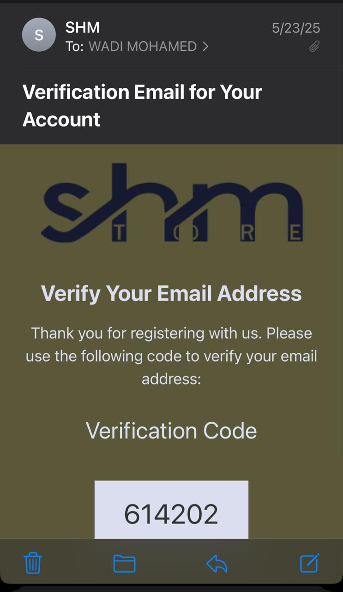

# Rapport du projet

**[Lien vers le rapport complet sur Google Drive](https://docs.google.com/document/d/1XyiVPiHoNUmiUEnxtgku4ev7R6fv0k5r/edit?usp=sharing&ouid=112579388462764512875&rtpof=true&sd=true)**

Une copie du rapport est également disponible dans le dossier `Rapport/rapport-pfa.docx` de ce dépôt.

---

## Projet réalisé par :
- Wadi Mohamed
- Araichi Mohamed
- Douaa Elgdah

Sujet : Gestion de bibliothèque

Groupe : 10 (3IIR)

# Projet Bibliothèque

Ce dépôt contient le code source d'une application web de gestion de bibliothèque développée en PHP.

## Fichiers exclus du dépôt

Pour maintenir une taille raisonnable du dépôt et éviter les problèmes de timeout lors des push vers GitHub, les fichiers suivants ont été exclus du suivi Git :

1. **Fichiers PDF volumineux** :
   - Tous les fichiers PDF dans le dossier `book/Emplacement/`, notamment :
     - `أول مرة أتدبر القرآن دليلك لفهم وتدبر القرآن من سورة الفاتحة إلى سورة الناس.pdf`
     - `أدب الأطفال علم وفن 3.pdf`
     - Divers autres PDF de livres

2. **Fichiers de dépendance volumineux** :
   - `plantuml.jar` - Bibliothèque Java pour générer des diagrammes UML

3. **Fichiers d'historique Git** :
   - Les fichiers pack volumineux dans le dossier `.git/objects/pack/`

## Comment récupérer les fichiers exclus

Si vous avez besoin des fichiers PDF ou d'autres ressources volumineuses qui ont été exclues du dépôt, vous pouvez :

1. Contacter l'administrateur du projet pour obtenir ces fichiers via un autre canal (service de partage de fichiers, disque externe, etc.)
2. Recréer les fichiers à partir des sources originales si disponibles
3. Pour les livres PDF, vous devrez peut-être les télécharger à nouveau ou les acquérir légalement auprès de leurs sources.

## Structure du projet

Le projet est organisé selon la structure suivante :
- `/ADMIN_PAGES` : Pages d'administration
- `/book` : Gestion des livres et images associées
- `/connexion` : Fonctionnalités de connexion et d'authentification
- `/includ` : Éléments d'interface réutilisables
- `/assets` : Ressources web (CSS, JavaScript, images)

## Configuration

Le projet utilise XAMPP comme environnement de développement.

## Fonctionnalités principales

Pour les clients, l'application propose une expérience fluide et intuitive : une page d'accueil permet d'accéder rapidement aux nouveautés et recommandations, tandis qu'un catalogue complet offre la possibilité de consulter et rechercher des livres par titre, auteur ou catégorie, avec des fiches détaillées pour chaque ouvrage. Les utilisateurs peuvent ajouter des livres à leur panier pour préparer leurs demandes d'emprunt, consulter une FAQ interactive pour résoudre les questions courantes, s'inscrire et se connecter de manière sécurisée, gérer leur profil et visualiser l'historique de leurs emprunts ainsi que le suivi de leurs demandes en cours.

Pour les administrateurs, un tableau de bord centralisé permet de superviser l'ensemble de la bibliothèque. Ils disposent d'outils pour ajouter, modifier, supprimer et organiser les livres, gérer les stocks et les catégories, ainsi que consulter, modifier ou supprimer les comptes utilisateurs. La gestion des emprunts est facilitée grâce au suivi des demandes, à la validation et au retour des livres. Des statistiques détaillées sur l'activité de la bibliothèque (emprunts, retours, utilisateurs actifs, etc.) sont accessibles, et la gestion de la FAQ se fait simplement via l'ajout ou la modification des questions/réponses.

## Sécurité de l'application

L'application utilise un système de vérification par email pour sécuriser les comptes utilisateurs :

*Capture d'écran du code de vérification envoyé par email lors de l'inscription.*

## Démos du projet

Vous pouvez visionner les démos du projet en cliquant sur les liens ci-dessous :

### Interface client

**[Cliquez ici pour voir la démo de l'interface client](https://github.com/mohamed-wadi/PROJET_BIBLIOTHEQUE/raw/records-branch/Records/Record.mov)**

### Interface admin

**[Cliquez ici pour voir la démo de l'interface administrateur](https://github.com/mohamed-wadi/PROJET_BIBLIOTHEQUE/raw/records-branch/Records/Record%20Part%20Admin.mov)**

*Note: Pour visualiser les vidéos directement sur GitHub sans les télécharger :*
1. *Cliquez sur le lien de la vidéo souhaitée*
2. *GitHub affichera une page avec la vidéo et un lecteur intégré*
3. *Appuyez sur le bouton de lecture pour la visionner directement dans votre navigateur*
